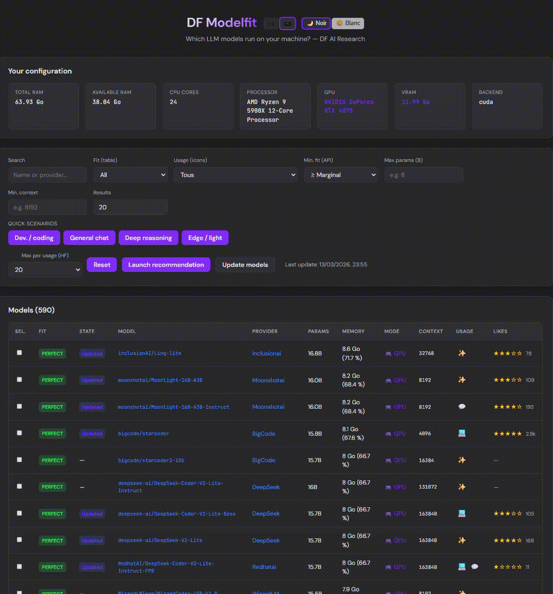

# Outil personnel de recommandation de modèles LLM
<p align="center">
  
  <a href="LICENSE"></a>
  
  
  
  <a href="CONTRIBUTING.md"></a>
</p>
Application web en français pour estimer quels modèles LLM sont adaptés à votre machine (RAM, CPU, GPU) et les comparer selon plusieurs critères.

- **Backend** : Python (FastAPI)
- **Frontend** : HTML, CSS, JavaScript
- **Données** : base de modèles au format JSON (ex. Hugging Face), logique de fit et de scoring calculée localement

## Démo

Sur GitHub, la vidéo ne s’affiche pas inline ; l’image ci‑dessous est cliquable et ouvre la vidéo.

[](DEMO.mp4)

*(Cliquez sur l’image pour ouvrir [DEMO.mp4](DEMO.mp4))*

## Fonctionnalités

- Détection matérielle (RAM, CPU, GPU, backend d’inférence probable).
- Calcul d’un niveau de fit pour chaque modèle : parfait, bon, marginal, trop juste.
- Scoring multi‑critères par modèle :
  - **Qualité** : basé sur la taille du modèle.
  - **Vitesse** : estimation de tok/s selon le backend et la taille.
  - **Fit** : adéquation à la mémoire disponible.
  - **Contexte** : longueur de contexte maximale.
  - **Score global** pondéré par cas d’usage.
- Recommandations via un endpoint dédié `/api/recommend` avec filtres (cas d’usage, fit minimal, taille max, contexte min, limite de résultats).
- Interface web avec :
  - tableau filtrable des modèles,
  - scénarios d’usage pré‑configurés,
  - comparaison de plusieurs modèles avec graphiques,
  - historique local des configurations,
  - génération de snippets Python d’exemple pour interroger un modèle.

- **Options disponibles** : langue FR/EN, thème clair/sombre, Réinitialiser, Lancer la recommandation, Mise à jour des modèles (HF), Max par usage (HF) 5/10/15/20, pagination et tri, réglages sauvegardés (localStorage), liens Soutien et Licence.

## Installation

```bash
cd df-modelfit   # ou le dossier du projet
python -m venv .venv
.venv\Scripts\activate   # Windows
# source .venv/bin/activate  # Linux / macOS
pip install -r requirements.txt
```

## Lancer l'application

### Windows (recommandé) : utiliser `lance.bat`

Double-cliquez sur **`lance.bat`** ou exécutez-le dans un terminal. Le script :
- vérifie la présence de `requirements.txt`,
- installe ou met à jour les dépendances (`pip install -r requirements.txt`),
- démarre le serveur dans une fenêtre dédiée,
- ouvre le navigateur sur **http://localhost:5050**.

Tout se fait en un clic ; fermez la fenêtre du serveur pour arrêter l'application.

### Tous systèmes : ligne de commande

```bash
python main.py
```

Puis ouvrir dans le navigateur : **http://localhost:5050**

## Données modèles

- **Depuis Hugging Face** : l’interface peut appeler un endpoint de mise à jour qui récupère les modèles depuis l’API HF. `HF_TOKEN` est optionnel pour les modèles nécessitant un jeton.
- **Fichiers locaux** :
  - au démarrage, chargement depuis `data/hf_models.json` ou `data/models.json` ;
  - vous pouvez mettre à jour ces fichiers pour changer la liste des modèles (format : tableau JSON d’objets avec au moins `name`, `provider`, `parameter_count`, `parameters_raw`, `min_ram_gb`, `recommended_ram_gb`, `min_vram_gb`, `context_length`, `use_case`).

## Structure

```
df-modelfit/
  api/
    system.py   # Détection matérielle (RAM, CPU, GPU)
    fit.py      # Calcul du fit et des scores (Q/S/F/C, énergie, coût)
  static/
    index.html  # Interface web principale
    style.css   # Styles (thème sombre, badges de fit, tableau responsive)
    app.js      # Logique front : appels API, filtres, graphiques, historique
  data/
    hf_models.json
    models.json
  main.py       # Serveur FastAPI
  requirements.txt
  lance.bat     # Lancement Windows (dépendances + serveur + navigateur)
```

## API principale

- `GET /api/system` — configuration matérielle détectée.
- `GET /api/models?search=...&fit=...` — liste des modèles avec niveau de fit et scores.
- `GET /api/models/top?limit=10` — meilleurs modèles qui passent sur la machine.
- `GET /api/recommend?use_case=...&limit=5&min_fit=bon&max_params=8&min_context=8192` — recommandations filtrées selon le cas d’usage et les contraintes.
- `POST /api/refresh` — charge les modèles depuis l’API Hugging Face (remplace la liste en mémoire).

Documentation interactive de l'API : **http://localhost:5050/docs** (Swagger) et **http://localhost:5050/redoc** (ReDoc).

## Documentation GitHub

- **[CONTRIBUTING.md](CONTRIBUTING.md)** — Comment contribuer (bugs, fonctionnalités, pull requests).
- **[CHANGELOG.md](CHANGELOG.md)** — Historique des changements du projet.
- **[SECURITY.md](SECURITY.md)** — Signaler une vulnérabilité de sécurité.
- **Issues** — Templates [Bug report](.github/ISSUE_TEMPLATE/bug_report.md) et [Feature request](.github/ISSUE_TEMPLATE/feature_request.md).
- **Pull requests** — [Template de PR](.github/PULL_REQUEST_TEMPLATE.md) proposé automatiquement.

## Soutien à la recherche

Un lien **Soutenez notre recherche** (soutien financier) figure dans le pied de page de l'application. Pour indiquer votre propre URL (don, sponsorship), modifiez la constante `SUPPORT_URL` dans `static/app.js` (valeur par défaut : `#soutien`).

## Licence

**Usage gratuit pour le public** (particuliers, usage personnel et non commercial). **Entreprises et laboratoires** : seule une **licence écrite et signée de la main** de l'auteur (DF AI Research) est acceptée. Voir [LICENSE](LICENSE). **Contact** : [contact@dfairesearch.com](mailto:contact@dfairesearch.com) — [https://dfairesearch.com/](https://dfairesearch.com/).

Dans l’application, lien « Voir la licence » : `http://localhost:5050/license`.

---

# DF Modelfit (English)

<p align="center">
  
  <a href="LICENSE"></a>
  
  
  
  <a href="CONTRIBUTING.md"></a>
</p>

Personal LLM model recommendation tool. Web app to estimate which LLM models fit your machine (RAM, CPU, GPU) and compare them.

- **Backend**: Python (FastAPI)
- **Frontend**: HTML, CSS, JavaScript
- **Data**: JSON model base (e.g. Hugging Face), fit and scoring logic computed locally

## Demo

The demo is shown directly below (GIF). Click to open the full video.

[](DEMO.mp4)

*Animated GIF — click to open video [DEMO.mp4](DEMO.mp4).*

## Features

- Hardware detection (RAM, CPU, GPU, likely inference backend).
- Fit level per model: perfect, good, marginal, too tight.
- Multi-criteria scoring: Quality, Speed, Fit, Context, weighted global score.
- Recommendations via `/api/recommend` with filters (use case, min fit, max size, min context, limit).
- Web UI: filterable and sortable model table (search, fit, usage, max params, min context, results per page), preset scenarios (dev / chat / reasoning / edge), comparison of 1–3 models with radar chart and Python snippet, local history (save, replay, reset), Python snippet generation.
- **Available options**: FR/EN language (flags), light/dark theme, Reset (filters), Launch recommendation, Update models (Hugging Face), Max per usage (HF) 5/10/15/20, pagination and column sort, settings saved automatically (localStorage), Support and License links in the footer.

## Installation

```bash
cd df-modelfit
python -m venv .venv
.venv\Scripts\activate   # Windows
pip install -r requirements.txt
```

## Run

### Windows (recommended): use `lance.bat`

Double-click **`lance.bat`** or run it in a terminal. The script:
- checks for `requirements.txt`,
- installs or updates dependencies (`pip install -r requirements.txt`),
- starts the server in a dedicated window,
- opens the browser at **http://localhost:5050**.

One click to run; close the server window to stop the app.

### All platforms: command line

```bash
python main.py
```

Then open **http://localhost:5050** in your browser.

## Documentation (GitHub)

- **[CONTRIBUTING.md](CONTRIBUTING.md)** — How to contribute (bugs, features, pull requests).
- **[CHANGELOG.md](CHANGELOG.md)** — Change history.
- **[SECURITY.md](SECURITY.md)** — Reporting a security vulnerability.
- **Issues**: [Bug report](.github/ISSUE_TEMPLATE/bug_report.md) and [Feature request](.github/ISSUE_TEMPLATE/feature_request.md) templates (FR/EN).
- **Pull requests**: [PR template](.github/PULL_REQUEST_TEMPLATE.md) (FR/EN).

## Support our research

A **Donate to our research** (financial support) link appears in the app footer. To use your own URL (donation, sponsorship), edit the `SUPPORT_URL` constant in `static/app.js` (default: `#soutien`).

## License

**Free use for the public** (individuals, personal and non-commercial use). **Companies and laboratories**: only a **written license signed by hand** by the author (DF AI Research) is accepted — no other form (email, click-wrap, verbal). See [LICENSE](LICENSE). **Contact**: [contact@dfairesearch.com](mailto:contact@dfairesearch.com) — [https://dfairesearch.com/](https://dfairesearch.com/). In the app: "View license" link → `http://localhost:5050/license`.
